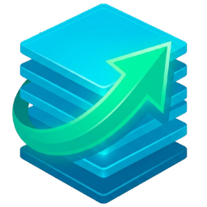
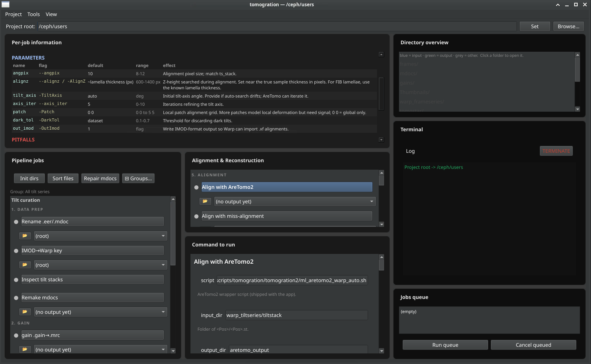

<p align="center">
  
</p>

<h1 align="center">Tomogration</h1>

<p align="center"><b>A GUI controller for the cryo-electron tomography preprocessing pipeline.</b></p>

Tomogration is a desktop app (PySide6) that drives a full cryo-ET workflow — from
raw movies to picked particles — by orchestrating the standard external tools
([WarpTools 2.0](https://github.com/warpem/warp),
[AreTomo2](https://github.com/czimaginginstitute/AreTomo2),
[IMOD](https://bio3d.colorado.edu/imod/), and the deep-learning aligner
[miss-alignment](https://github.com/warpem/miss-alignment)). Every step is a
button with a form; the app builds the exact shell command, shows it to you
(editable), runs it, streams the log, and tracks outputs — so you get the
reproducibility of the command line with the convenience of a GUI.



> **Scope:** raw data preparation → template matching / `ts_export_particles`.
> Subtomogram averaging (RELION 5 `--tomo` / M) is intentionally *out of scope* —
> Tomogration hands off to it, it doesn't reimplement it.

Tomogration is a **wrapper/controller**: it doesn't reimplement any cryo-ET
algorithm, it runs the real tools and manages the bookkeeping around them
(file naming, versioned outputs, tilt exclusions, mdoc repair, run history).

---

## Why it exists

The WarpTools tilt-series pipeline is powerful but is a long sequence of
command-line steps, each with fiddly interdependencies (pixel sizes that must
match, alignment that must be imported before CTF, tilt-axis quirks from Tomo5
mdocs, GPU/driver traps, versioned AreTomo folders…). Tomogration encodes those
dependencies and the hard-won gotchas so you — and your collaborators — don't
rediscover them each time. The command it runs is always visible and editable,
so nothing is hidden and you can still drop to the terminal any time.

---

## What the interface gives you

- **A pipeline laid out as clickable steps**, grouped (Data prep → Gain → Tilt
  series → Alignment → CTF → Reconstruct → Pick), each with a status dot.
- **A parameter form per step** with inline help, and a **live command box** that
  shows exactly what will run. Edit the form *or* the command directly.
- **Your parameter edits persist** — per step, across restarts — until you change
  them, a newer input version supersedes them, or you hit **Reset defaults**.
- **A queue** to chain steps, a streaming **terminal**, and a **directory
  overview** that colour-codes inputs/outputs and opens folders on click.
- **Open outputs in one click** — a 📂 (file manager) and a **3dmod** button next
  to each step's output, so you never hand-type `module load 3dmod; 3dmod *.mrc`.
- **A Tilt Inspector** to review series, exclude bad tilts/whole series, and open
  them in 3dmod.
- **A Processing History** window: a flowchart of every run, its non-default
  parameters, and clickable input/output files (openable with 3dmod/gedit).

---

## The pipeline, step by step

| Group | Step | What it does |
|---|---|---|
| **1. Data prep** | Rename / Sort | Rename raw EER + mdocs to `Position###`, sort into the project layout |
| | Inspect tilt stacks | Review series, mark bad tilts / whole series for exclusion |
| | Remake mdocs | Apply tilt exclusions and renumber mdoc ZValue blocks |
| **2. Gain** | gain convert / reciprocal | Convert the `.gain` reference to the `.mrc` Warp expects |
| **3. Frame series** | create settings / fs_motion_and_ctf | Motion-correct + estimate per-movie CTF |
| **4. Tilt series** | ts_import / ts_stack | Build `.tomostar` tilt series and the aligned tilt stacks |
| **5. Alignment** | **Align with AreTomo2** | Coarse fiducial-less alignment (writes IMOD `.xf`/`.tlt`) |
| | **ts_import_alignments** | Pull AreTomo's alignment into the Warp `.xml` |
| | **sync selection** | Deselect series that have no alignment |
| | **miss-alignment (train)** | Train a DL model on this set to *refine* the coarse alignment |
| | **miss-alignment (infer)** | *Reuse* that trained model to align a larger set, no retraining |
| **6. CTF** | ts_defocus_hand / ts_ctf | Fix defocus handedness, estimate tilt-series CTF |
| **7. Reconstruct** | ts_reconstruct | Back-project aligned, CTF-corrected tilts into tomograms |
| **8. Pick** | ts_template_match / threshold / export | Template-match particles and export them |

Left-panel documentation for every step (what/why/parameters/pitfalls) lives in
`tomogration_docs.json` and is shown in-app.

### Alignment: AreTomo **then** miss-alignment (not either/or)

This is the most misunderstood part of the workflow, so it's enforced in the app:

- **AreTomo2** does the coarse, fiducial-less alignment and (crucially) **solves
  the tilt-axis angle**. Its `.xf`/`.tlt` are pulled into Warp with
  `ts_import_alignments`.
- **miss-alignment is a *refiner*, not an alternative** — its own docs say it
  *"starts from an initially coarse aligned dataset."* Run on raw stacks it produces
  a featureless tomogram. Tomogration therefore **blocks** the train step unless a
  coarse AreTomo alignment exists, and on a fresh run it auto-prepends the
  AreTomo→import→select chain so the trained model starts from the right place.
- **Train once, infer everywhere.** Train a model on a small, clean subset
  (`miss-alignment (train)`), then apply it to your full dataset with
  `miss-alignment (infer)` — no retraining. Infer reuses the saved
  `iterN/model.ckpt` checkpoints.

miss-alignment needs its **own conda env** (it ships its own CUDA/torch stack —
*not* the Warp env):

```bash
conda create -n miss-alignment -c conda-forge python=3.11 cuda-toolkit=12.9 -y
conda activate miss-alignment
python -m pip install torch==2.8.0 numpy
python -m pip install torch-projectors --index-url https://warpem.github.io/torch-projectors/cu129/simple/
python -m pip install "git+https://github.com/warpem/miss-alignment.git"
```

---

## Requirements

**On the workstation (Linux):**
- A CUDA GPU + NVIDIA driver, with the external tools installed and loadable
  (typically via `module load` / conda): **WarpTools 2.0**, **AreTomo2**,
  **IMOD/3dmod**, and (optional) **miss-alignment** in its own conda env.
- Python 3.10+ for the GUI. `install.sh` builds an isolated `.venv` with PySide6
  (Debian/Ubuntu block system `pip` under PEP 668, so a venv is required).
- Qt 6.5+ needs `libxcb-cursor0`; `fetch_xcb_libs.sh` fetches it without sudo if
  it's missing.

Tomogration is developed on macOS but **only runs on Linux** — on the Mac it is
only syntax-checked, never launched.

---

## Install & launch

Copy this whole folder to the workstation, then from inside it:

```bash
bash install.sh      # one-time: builds .venv, fetches Qt libs, registers the launcher
bash tomogration.sh  # launch (or use the Applications menu → Science → Tomogration)
```

`install.sh` is idempotent and self-healing (it rebuilds the venv if a different
machine's Python broke it, skips work already done, and self-tests). **Run it once
per workstation** — the `.venv` may live on shared storage, but each machine's
`$HOME` launcher entry is local.

---

## What every file is

```
tomogration_app.py            The application. A data-driven pipeline (STAGES list) +
                              a pure command assembler (build_command) + ProjectState
                              (all filesystem logic) + the PySide6 UI.
tomogration_docs.json         Per-step documentation shown in the left panel.
tomogration.sh                Self-locating launcher (finds the venv, sets Qt paths, runs the app).
tomogration.desktop           XDG desktop-entry template (install.sh fills in the path).
install.sh                    Builds the venv, fetches Qt libs, registers the launcher.
fetch_xcb_libs.sh             Fetches libxcb-cursor0 without sudo when the wheel lacks it.
Tomogration-icon.png          Launcher icon.
tomogration_brief.md          Design brief / internal reference for the pipeline.
LICENSE                       MIT (this wrapper). External tools keep their own licenses.
CONTRIBUTING.md               How to contribute + how to test without a GPU/display.

Companion scripts the app shells out to (keep them beside tomogration_app.py —
their paths are resolved automatically):

ml_batch_rename_eer_mdoc_mrc_warp_auto.sh   Rename raw EER/mdoc/mrc to Position### and sort.
ml_imodtowarpkey_generator_warp_auto.py     Build the IMOD→acquisition-order conversion key.
ml_batch_remake_mdocs_warp_auto.sh          Apply tilt exclusions + renumber mdoc ZValues.
ml_aretomo2_warp_auto.sh                    Parallel AreTomo2 farm (handles the CUDA/setgid traps).
ml_missalignment_warp_auto.sh               miss-alignment wrapper (train + infer modes).
ml_add_thumbnails_warp_auto.sh              Carry Tomo5 thumbnails into a merged project, renamed.
ml_make_training_set_warp_auto.sh           Build a fresh miss-alignment training subset (selected/).
ml_merge_datasets_warp_auto.sh              Merge multiple grids into one continuously-numbered project.
```

---

## How settings persist

- **Per-step parameters** you edit are saved and restored automatically (in
  `~/.tomogration.json`). They persist across restarts. A step's **Reset defaults**
  button discards its saved edits; a newer input version (e.g. a fresh AreTomo
  folder) automatically supersedes the stored value for that field.
- **`warp_launch`** — how `WarpTools` is invoked on your cluster (e.g.
  `module load warp && WarpTools`) — is set once from the Tools menu.
- **Processing history** for a project is stored in `.tomogration_history.json` in
  the project root; existing outputs are archived (never overwritten) on re-run of
  the steps that support it.

---

## Troubleshooting (the traps this app was built to survive)

- **AreTomo "GPU is invalid" / `libcufft.so.11` not found.** The shared AreTomo2
  binary is often setgid (the loader then ignores `LD_LIBRARY_PATH`) and cluster
  CUDA modules ship a *stub* `libcuda`. `ml_aretomo2_warp_auto.sh` runs a
  non-setgid copy from a stub-free library farm to avoid both.
- **`ts_import_alignments`: "Could not find PositionNNN.xf".** AreTomo auto-versions
  its output folder; import from the folder that actually holds the `.xf` (the app
  tracks the newest one). If a run was killed, alignments may be partial — deselect
  the unaligned series with the **sync selection** helper.
- **miss-alignment made a featureless tomogram.** It refines; it doesn't align raw
  stacks. Coarse-align with AreTomo first (the app enforces this).
- **`ts_reconstruct` "stuck at 0/15".** You asked for native pixel size — a full
  native tomogram is ~260× a 10 Å one. Reconstruct at `--angpix 10`.
- **`ts_template_match` "reconstruction at the desired resolution was not found".**
  `--tomo_angpix` must equal a `ts_reconstruct --angpix` you already ran.
- **"tilt axis … Tomo5 mdoc files are known to provide incorrect values".** Advisory,
  printed for *every* Tomo5 mdoc — the tilt-*axis* angle (~-174°) is not your tilt
  range, and AreTomo refines it anyway.
- **A GPU is unexpectedly slow.** Orphaned processes from a killed run may still hold
  it. `nvidia-smi` shows only *your* PIDs, so judge by GPU-Util %, and clear
  leftovers with `pkill -u $USER -f <that run's tmp binary hash>`.

---

## Contributing

Bug reports and focused PRs welcome — see [CONTRIBUTING.md](CONTRIBUTING.md).
The golden rule: it's developed on macOS but runs on Linux, so keep
`python3 -m py_compile tomogration_app.py` and `bash -n *.sh` green, and never
commit microscopy data.

## License

[MIT](LICENSE) © 2026 Miron Leanca and The Rosalind Franklin Institute. Tomogration orchestrates
external tools (WarpTools, AreTomo2, IMOD, miss-alignment, RELION/M) that carry
their own licenses — see the note at the bottom of `LICENSE`.

## Acknowledgements

Tomogration stands on the shoulders of the tools it drives — thanks to the Warp,
AreTomo, IMOD, and miss-alignment developers.
